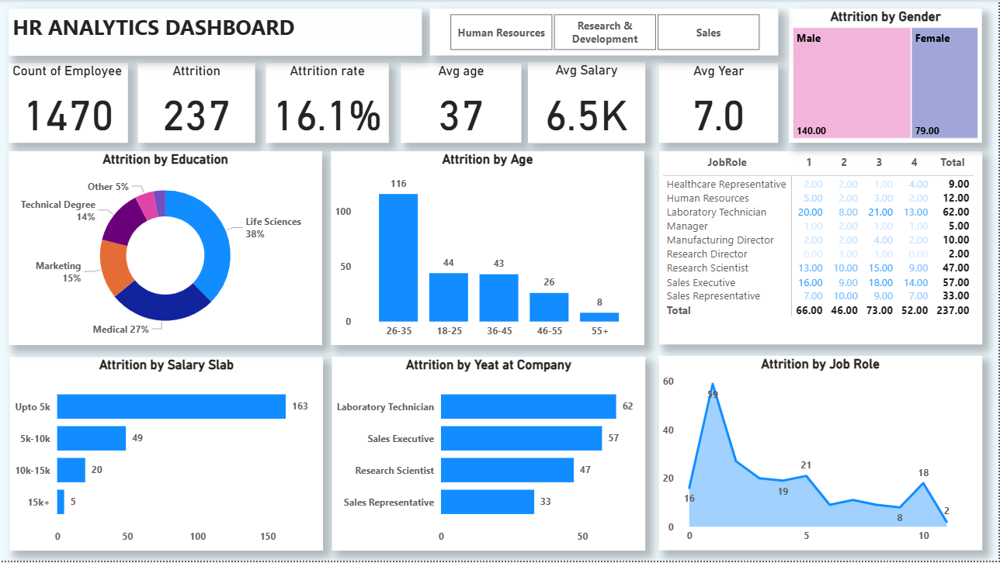

# HR-Analytics-Dashboard

## 📌 Objective 
This project analyzes HR data to identify employee attrition patterns and factors affecting workforce retention.

## 📊Tools Used
- Ecxcel / Power BI
- Data Cleaning
- Data Visualization

## 🧹 Data Preparation
-Remove duplicate records and handled missing values
-Standardized columns (Job Role, Salary Slab, Education)
-Created calculated fields (Attrition Rate and Average Salary)
-Grouped data into cateegories (Age groups, Salary slab, Experience levels)
Verified data consisteency for accurate analysis

## 📈 Key Insights

### 1. Overall Attrition
- Total employees: 1470  
- Attrition count: 237  
- Attrition rate: 16.1%  
👉 Indicates moderate employee turnover

### 2. Salary Impact
- Majority attrition from employees earning up to 5K  
👉 Lower salary employees are more likely to leave

### 3. Age Group Analysis
- Highest attrition in 26–35 age group  
👉 Mid-career employees are most likely to switch jobs

### 4. Job Role Analysis
- Laboratory Technicians and Sales Executives show highest attrition  
👉 High attrition in Sales and Lab roles indicates potential workload imbalance or role-specific dissatisfaction.

### 5. Experience / Tenure
- Higher attrition among early-tenure employees suggests weak onboarding or lack of early engagement strategies.
👉 Early-stage employees are less retained

### 6. Gender Distribution
- Higher attrition observed among male employees  
👉 Possible imbalance in workforce retention

### 7. Key Metrics
-Total Employees: 1470
-Attrition Count: 237
-Attrition Rate: 16.1%
-Average Salary: 6.5k
-Average Age: 37
-Average Experience: 7 years

## 💡 Business Recommendations

- Increase salary or benefits for lower salary employees to reduce attrition  
- Focus retention strategies on employees aged 26–35  
- Improve work conditions for high-attrition roles like Sales and Lab Technicians  
- Strengthen onboarding and engagement programs for new employees  
- Conduct exit analysis to identify root causes of attrition

## Dashboard Preview

## 📌Conclusion
This analysis highlights key factors driving employee attrition and provides actionable insights to improve workforce  retention and organizational performance.
